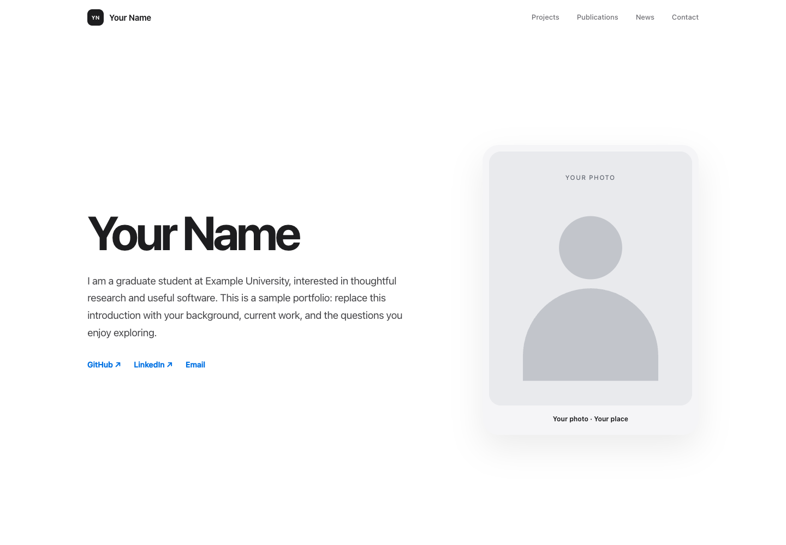

# Minimal Academic Website

A quiet, responsive starting point for a personal academic website. Share your background, projects, publications, and notes from study and life.

Built with HTML, CSS, and JavaScript. No framework, package installation, or build step is needed for the website itself.



All names, affiliations, publications, and updates in the demo are placeholders. The illustrations are generic SVG assets; no personal photographs or CV are included.

## Features

- A light interface with system fonts, restrained spacing, and responsive project cards.
- A skippable opening animation and one-time scroll reveals.
- Publications with linked titles, years, and venue information.
- News with text-only entries, single images, and a three-slide carousel.
- Keyboard navigation, visible focus states, and reduced-motion support.
- Local assets and no required third-party services, trackers, or API keys.

## Getting started

1. Download this template, or use **Use this template** if that option is enabled on GitHub.
2. Replace the sample content in `index.html` using the checklist below.
3. Choose one of the three deployment methods below.

Run all commands from the directory containing **this README and `index.html`**. If you received a folder named `template`, enter that folder first. When uploading to a new repository, upload its **contents** to the repository root, not the enclosing folder or a personal-site backup.

## 1. Run locally

Install Python 3, then start a local preview server:

```sh
python3 -m http.server 4173 --bind 127.0.0.1
```

Open [http://localhost:4173](http://localhost:4173). Stop the server with `Ctrl+C`. On Windows, `py -m http.server 4173 --bind 127.0.0.1` is an alternative.

You can also open `index.html` directly, but a local HTTP server is a better deployment preview. Python's development server is for local preview, not public hosting.

## 2. Publish with GitHub Pages

1. Create a repository and upload the template files to its root. Include `index.html`, `assets/`, and the empty `.nojekyll` file.
2. For a personal homepage, name the repository **`YOUR-USERNAME.github.io`**. For a project site, any repository name works.
3. Open **Settings → Pages → Build and deployment**.
4. Set **Source** to **Deploy from a branch**. Choose **main** and **/(root)**, then save. Use your actual default branch if its name differs.
5. Wait for GitHub's deployment to finish. The Pages settings show the published URL:
   - Personal homepage: `https://YOUR-USERNAME.github.io/`
   - Project site: `https://YOUR-USERNAME.github.io/REPOSITORY/`

Keep asset paths relative, such as `assets/styles.css`, so both URL layouts work. No Jekyll setup or custom GitHub Actions workflow is required. Repository visibility and Pages availability depend on your GitHub plan; a public repository is the simplest option.

To update the site, push the changed files to the selected branch. GitHub Pages publishes them automatically. Configure a custom domain only after the default Pages URL works; no personal domain or `CNAME` file is included here.

See [GitHub's publishing-source guide](https://docs.github.com/en/pages/getting-started-with-github-pages/configuring-a-publishing-source-for-your-github-pages-site).

## 3. Deploy with Docker / NAS

Requires Docker Engine or Docker Desktop with Docker Compose v2. From the template directory:

```sh
docker compose up -d --build
```

Open [http://localhost:8088](http://localhost:8088), or `http://YOUR-NAS-IP:8088` from another device on your local network. Allow that port in the NAS firewall if needed. Choose another host port by changing `8088` in `compose.yaml` or setting `PORT`.

The Docker image uses [official Nginx](https://hub.docker.com/_/nginx) and includes only `index.html`, `assets/`, and the Nginx configuration. Git history, documentation, environment files, and backups are not copied into the image. There is no credential or tunnel configuration in this template.

**After editing files, rebuild the image:**

```sh
docker compose up -d --build
```

This is an image-based deployment, not a live directory mount. `docker compose restart` alone does **not** copy updated source files into the image. On a NAS, upload the revised template files first and then run the rebuild command in that directory, or use the NAS interface's equivalent rebuild action.

Useful commands:

```sh
docker compose ps
docker compose logs --tail=50 website
docker compose down
```

The service provides HTTP on port 8088 by default. For public access, configure your own domain and HTTPS through a reverse proxy or tunnel. Keep its credentials outside this repository. This setup does not automatically replace an existing NAS website or change DNS.

If Docker Hub is unreachable, configure a trusted registry mirror in Docker. The Dockerfile also accepts a `NGINX_IMAGE` build argument for an approved alternative image; avoid untrusted mirrors. A registry/network timeout is separate from a website configuration error.

## Make it yours

| What to change | Where |
| --- | --- |
| Name, initials, biography, intro text | `index.html`: header, opening animation, hero, and footer |
| Browser title, description, author, social metadata | `index.html`: `<head>` |
| Portrait and caption | `assets/profile-placeholder.svg` and the hero image in `index.html` |
| Project titles, descriptions, tags, links, and previews | `index.html`: `#projects` |
| Research interests, paper titles, authors, venues, and links | `index.html`: `#publications` |
| News dates, text, images, and carousel descriptions | `index.html`: `#news` |
| Email and profile links | `index.html`: hero and `#contact` |
| Favicon initials | `assets/favicon.svg` |
| Colors, type, spacing, and responsive layout | `assets/styles.css` |
| Opening animation, menu, and carousel | `assets/site.js` |
| Scroll reveals | `assets/scroll-reveal.js` |

The sample links use `example.com`, `hello@example.com`, and `your-username`; they are not working project/profile links. Replace them or remove unused links before publishing. Sample publications are explicitly illustrative, not real papers.

### Images and CV

- Project covers: **16:9**, for example 1200 × 675 px.
- News and carousel images: **7:5**, for example 1400 × 1000 px.
- Portrait: approximately **3:4**; keep the subject near the center.
- Update image paths, intrinsic `width` / `height`, and meaningful `alt` text when replacing assets.
- Use compressed WebP or JPEG for photographs and suitable PNG/SVG assets for graphics. Keep originals outside the public repository.
- No real CV or dummy download is included. To add one, put a reviewed public PDF at `assets/cv.pdf` and add this link inside `.hero-actions`:

```html
<a class="button button-primary" href="assets/cv.pdf"
   target="_blank" rel="noopener">View CV</a>
```

The optional GitHub star-count behavior remains in `assets/site.js`, but no counter is enabled in the demo. To enable it, add a `data-github-stars="OWNER/REPOSITORY"` container with a `[data-star-count]` child. It uses GitHub's public API without a token; requests can be rate-limited.

## Before publishing

- Replace all placeholder content, including metadata and image descriptions.
- Test desktop and mobile layouts, keyboard navigation, links, and reduced motion.
- Check your CV and photos for private details and unnecessary image metadata.
- Do not upload credentials, `.env` files, backups, or another site's `.git` directory.
- If the source repository ever contained personal files, deleting them from the latest revision is not enough to remove them from Git history. Publish this clean template from a new history.
- Update the `?v=...` references in `index.html` when changing scripts or styles, and refresh your preview screenshot after significant design changes.

## Project structure

```text
index.html              Page content and metadata
assets/                 Styles, scripts, favicon, and generic illustrations
docs/preview.png        Screenshot of the anonymized template
.nojekyll               Serve the plain static site on GitHub Pages
Dockerfile              Build a minimal Nginx site image
compose.yaml            Run the image locally or on a NAS
nginx.conf              Static serving and cache revalidation
LICENSE                 MIT license
THIRD_PARTY_NOTICES.md   Third-party icon attribution
```

## Acknowledgments

- [Academic Pages](https://github.com/academicpages/academicpages.github.io) inspired the user-focused documentation structure and template onboarding. This project does not use its Jekyll theme or require its build tools.
- The **`apple-design` skill** used during development helped guide typography, visual hierarchy, restrained motion, and reduced-motion behavior. It is a development aid, not a runtime dependency; its text is not distributed here.
- Apple's [Designing Fluid Interfaces](https://developer.apple.com/videos/play/wwdc2018/803/) informed the interaction principles behind that skill. This is an independent project, not an official Apple template or an Apple-endorsed product.
- The GitHub icon is based on [Octicons](https://github.com/primer/octicons); see [third-party notices](THIRD_PARTY_NOTICES.md).

## License

The template code, documentation, and original placeholder SVG illustrations are available under the [MIT License](LICENSE). Retain the copyright and license notice when redistributing the template. Third-party material remains subject to its own notices.

Personal photographs, the original author's CV, and original personal-site content are not included in this template and are not licensed by it. When adding your own content, decide and document its reuse terms separately.
